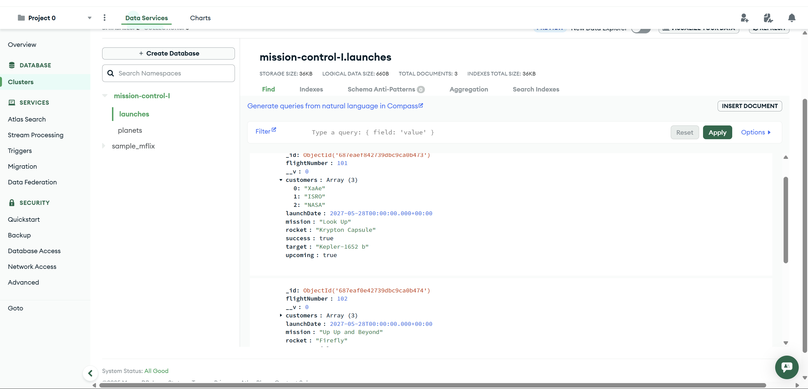

# 🚀 Mission Control

Mission Control is a full-stack web application focused on simulating space mission planning and control. Built with a **Node.js Express backend** and a **React frontend**, it allows users to schedule space launches to habitable exoplanets, view upcoming missions, and review past launches.

>[!NOTE]
> 🔧 **Project is under development** – frontend redesign and ~full DB integration are ongoing~.

---

### 🌐 Live Demo

<!-- Replace with actual GIF or hosted link -->


---

### 📸 UI Preview


---

## 📁 Project Structure

### 🔻 Backend (Express.js + MongoDB)

The backend is built with **Node.js**, **Express**, and now includes **MongoDB persistence using Mongoose**. RESTful APIs are used for managing planetary data and launch scheduling.

#### Key Backend Routes:

| Endpoint           | Method | Description                          |
|--------------------|--------|--------------------------------------|
| `/planets`         | GET    | Returns all habitable planets        |
| `/launches`        | GET    | Lists all scheduled launches         |
| `/launches`        | POST   | Schedule a new launch                |
| `/launches/:id`    | DELETE | Abort a launch by ID                 |

- Planetary data sourced from NASA’s [Kepler Exoplanet Archive](https://exoplanetarchive.ipac.caltech.edu/).
- All launch and planet data now persist in **MongoDB Atlas** via **Mongoose** ODM.

> [!TIP]
> ⚙️ **To connect to the database** after forking the project:
> 1. Create a `.env` file inside the `server/` folder.
> 2. Add the following line:
>    ```env
>    MONGO_URL="your-mongodb-connection-uri"
>    ```
> 3. If you need access to the MongoDB cluster or API keys, feel free to reach out via [LinkedIn](https://linkedin.com/in/srijan-petwal), [X (Twitter)](https://x.com/srijancs), or by opening an issue in this GitHub repo.

---

#### 📸 Insomnia API Testing

| Test Type        | Screenshot                                       |
|------------------|--------------------------------------------------|
| GET /planets     |  |
| POST /launches   |  |
| DELETE /launches |  |

---

### 🚀 Performance Optimization with PM2

To simulate multi-core performance and handle load efficiently, the backend supports **PM2 Clustering**.

- PM2 forks multiple instances based on CPU cores.
- Helps simulate concurrent requests in a production-like setup.

📸 PM2 Cluster Mode in Action:


> ~🔧 **Note:** The current version still has concurrency issues due to in-memory use of `Map` for storing launch data. These issues will be resolved as persistence (MongoDB) is now being integrated.~ Issue Resolved!!!😁

---

### 🔺 Frontend (React)

The frontend is built using **React** and **react-router-dom** for navigation between mission control views.

#### Frontend Routes:

| Path           | View Description                          |
|----------------|-------------------------------------------|
| `/launch`      | Schedule a new mission launch             |
| `/upcoming`    | View all scheduled and pending launches   |
| `/history`     | View history of successful and aborted launches |

> ⚠️ A complete **UI/UX redesign** is planned.

---

## 🔍 Features

- Filter habitable planets based on real NASA scientific data.
- Schedule new space launches with validated input.
- View upcoming and historical launches.
- Abort missions pre-launch.
- Persistent backend storage using **MongoDB + Mongoose**.
- Performance optimization via **PM2 clustering**.
- API tested using **Insomnia**.

---

## 🌌 SpaceX Launches Integration

The History section now features real-time data from **SpaceX launches** using the awesome [SpaceX API](https://github.com/r-spacex/SpaceX-API). All previous launches by SpaceX are fetched and rendered on the frontend!

| API Testing Snapshot | SpaceX Launch Data Rendered | 
|----------------------|-----------------------------|
|  |  |

## Populated SpaceX Launch History: Demo 
 

> [!TIP]
> This integration allows you to explore real historical space launches alongside your custom scheduled ones. Super cool if you love spaceflight history as much as I do! 😄

---

### 🧩 MongoDB Collections Preview

To verify persistence, here are sample screenshots from the live MongoDB Atlas database showing both the `launches` and `planets` collections populated via API operations:

#### 🚀 Launches Collection



#### 🌍 Planets Collection


> [!TIP]
> These screenshots reflect real-time data stored in MongoDB using Mongoose models. API operations such as GET, POST, and DELETE update these collections directly.  
> Also everything here is mock data, and there's no sensitive information exposed. I always double-check what I upload to make sure it's safe and clean before committing or sharing.😄

---

## 🛠️ Technologies Used

| Layer         | Tools & Libraries                                   |
|---------------|------------------------------------------------------|
| **Backend**   | Node.js, Express, Mongoose, MongoDB Atlas, PM2       |
| **Frontend**  | React, React Router DOM                              |
| **Testing**   | Insomnia (API Testing)                               |
| **Data**      | NASA Kepler Exoplanet Archive (CSV)                  |

---

## 🧱 Architectural Diagram


---

## 🧠 Inspiration & Focus

Inspired by real-world space mission control systems and modern backend architecture. This project emphasizes:

- Modular backend architecture  
- API-first development  
- Frontend-backend integration via REST  
- Optimizing deployment and performance workflows  

---

## 🚧 Work in Progress

- [x] Add MongoDB data persistence with Mongoose  
- [x] Integrate SpaceX Launch History API  
- [ ] Add authentication and security features  
- [ ] Redesign frontend UI from scratch  
- [ ] Add unit and integration tests  
- [ ] Improve error handling and validation  
- [x] Replace in-memory storage logic fully with DB logic  

---

## 🚀 Project Status

This project is actively being developed, with a current focus on **scalability**, ~**persistent storage**~, and **clean architecture**.

---
